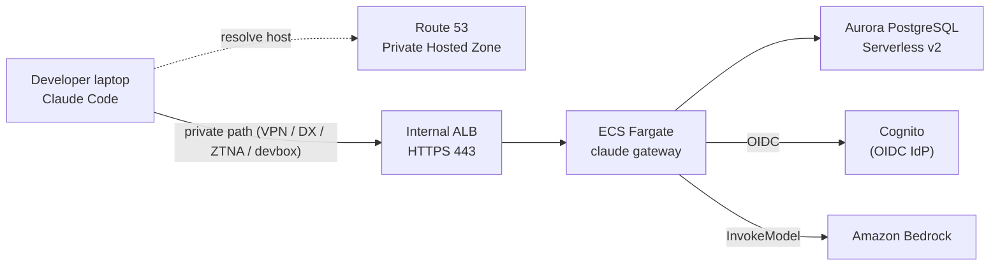

# Claude Apps Gateway on AWS

TypeScript AWS CDK that deploys Anthropic's self-hosted
[Claude Apps Gateway](https://code.claude.com/docs/en/claude-apps-gateway) on
Amazon Bedrock. Developers sign in through an **Amazon Cognito-native IdP** (OIDC) and
reach the gateway only over a **private network** — no AWS or Anthropic credentials are
handed to individuals.

> **Private-network requirement.** Claude Code's `/login` only connects to a gateway
> whose hostname resolves to private IPs. Keep CloudFront and public DNS off the
> login path. See [Why a private network](#why-a-private-network).

Throughout this guide the gateway URL `https://claude-gateway.corp.example.com` and
account/region values are **masked examples** — substitute your own.

> **Scope.** Identity is an **Amazon Cognito-native IdP**: Cognito is the user
> directory and users are created directly in the pool (e.g. `admin-create-user`).
> Federating an external corporate IdP (Entra / Okta / Google Workspace) into Cognito
> is possible but out of scope here. The stack targets **`us-east-1`** — commands and
> examples assume that region; other regions can work but need review (Bedrock model
> availability, and a `models:` block in the gateway config for non-US regions).

## Highlights

- **Cognito-native sign-in, not keys** — Amazon Cognito (OIDC) is the IdP; short-lived
  tokens, users managed directly in the Cognito user pool.
- **Credentials stay in AWS** — Bedrock is called through the ECS task role, never
  static keys on laptops.
- **Private by design** — internal ALB + Route 53 Private Hosted Zone; the login and
  inference path never leaves your network.
- **Managed state** — Aurora PostgreSQL Serverless v2 for the device flow, sessions,
  and rate limits.
- **All infrastructure as code** — one CDK stack (written for `us-east-1`),
  reproducible in any account by changing context values.

## Table of Contents

1. [Architecture](#architecture)
2. [Prerequisites](#prerequisites)
3. [Deploy with CDK](#deploy-with-cdk)
4. [AWS Client VPN](#aws-client-vpn)
5. [Cleanup](#cleanup)

Also: [Troubleshooting](#troubleshooting) · [Documentation](#documentation) · [License](#license)

## Architecture

A developer on a private path resolves the gateway host to the **internal ALB**, which
fronts the **ECS Fargate** gateway; the gateway signs users in via **Cognito** (OIDC),
keeps state in **Aurora**, and calls **Bedrock** through its task role.



Full diagram, request path, network isolation, and the security-group matrix:
[`docs/architecture.md`](docs/architecture.md).

### What gets deployed

| Resource | Purpose |
|---|---|
| VPC (2 AZs, 1 NAT) | Public / application / isolated-database subnet tiers |
| Internal ALB (HTTPS 443) | TLS termination (ACM); 443 only from `allowedClientCidrs` |
| ECS Fargate service | Runs `claude gateway`; task role limited to Bedrock `InvokeModel*` |
| Aurora PostgreSQL Serverless v2 | Device flow, sessions, rate-limit state (isolated) |
| Cognito User Pool + client | OIDC identity provider (email sign-in, confidential client) |
| ACM certificate | Gateway TLS cert, DNS-validated via the public hosted zone |
| Secrets Manager (×3) | DB credentials, JWT secret, Cognito client secret |
| Route 53 Private Hosted Zone | Private A-record for the gateway host → ALB |
| CloudWatch Logs + alarm | Gateway logs (1-month) + unhealthy-host alarm |

Not created: CloudFront, public DNS for the gateway host, Client VPN / Direct Connect
/ ZTNA, Route 53 Resolver endpoints, or Cognito users.

### Why a private network

At `/login`, Claude Code requires the gateway hostname to resolve **only** to private
addresses (RFC 1918, CGNAT `100.64.0.0/10`, IPv6 ULA `fc00::/7`, or loopback). If any
resolved IP is public, it rejects the URL. This is a security guard: a trusted gateway
can push managed settings that run commands on developer machines, so gateways are
restricted to private addresses. That is why the ALB is **internal** and its record
lives in a **private hosted zone** — and why developers need a private path
([Client VPN](#aws-client-vpn)) and private DNS ([`docs/dns.md`](docs/dns.md)). See the
upstream [Quickstart](https://code.claude.com/docs/en/claude-apps-gateway#quickstart)
and [Prerequisites](https://code.claude.com/docs/en/claude-apps-gateway#prerequisites).

## Prerequisites

**Local tools:** Node.js + npm, Docker (CDK builds the `linux/arm64` gateway image),
AWS CLI credentials for the target account, and `curl` + `gpg` for the binary
preparation step (`brew install gnupg` on macOS).

**AWS / gateway** (maps to the
[upstream prerequisites](https://code.claude.com/docs/en/claude-apps-gateway#prerequisites)):

- **Claude Code v2.1.195+** on the gateway image and every developer machine.
- **Bedrock model access** enabled for the Claude models you use.
- A **public Route 53 hosted zone** named `hostedZoneName` in the account — the stack
  issues the ALB certificate there via ACM DNS validation.
- A **private network path** for developers (VPN / Direct Connect / ZTNA / devbox) —
  see [AWS Client VPN](#aws-client-vpn).
- Cognito is provisioned by this stack as the OIDC IdP (SAML and LDAP are not
  supported by the gateway).

## Deploy with CDK

### 1. Configure

Real values live in `cdk.context.json` (gitignored; also caches Route 53 lookups).
Create it from the template and edit the key values:

```bash
cp cdk.context.json.example cdk.context.json
# edit at least: gatewayHost, hostedZoneName, awsAccount, allowedEmailDomains, cognitoDomainPrefix
```

| Context key | Meaning |
|---|---|
| `gatewayHost` | Private gateway FQDN (also the ACM cert subject) |
| `hostedZoneName` | Route 53 zone name; a **public** zone of this name must exist for cert validation |
| `awsAccount` / `awsRegion` | Deployment target (needed for the hosted-zone lookup) |
| `allowedClientCidrs` | CIDRs allowed to reach the internal ALB on 443 (VPN/corporate/devbox) |
| `allowedEmailDomains` | Cognito ID-token email domains the gateway accepts |
| `cognitoDomainPrefix` | Cognito hosted-domain prefix (globally unique per region) |
| `bedrockRegion` | Region for Bedrock inference |
| `claudeVersion` | Pinned Claude Code version baked into the image |
| `desiredCount` / `natGateways` | Fargate task count / NAT Gateway count |

Defaults in [`lib/config.ts`](lib/config.ts) are placeholders; context always
overrides them, and any value can also be passed per-command with `cdk -c key=value`.

### 2. Prepare the Claude binary

```bash
npm run prepare:claude -- 2.1.195
```

Downloads and cryptographically verifies (GPG signature + SHA256) the native
`linux-arm64` `claude` binary and writes `docker/claude`, which the image requires —
the gateway server runs only the native binary.

### 3. Build, bootstrap, and deploy

```bash
npm install
npm run build && npm test
npm run cdk -- bootstrap aws://ACCOUNT_ID/us-east-1   # once per account/region
npm run cdk -- deploy
```

The first deploy pauses a few minutes while ACM validates the certificate via the DNS
record it creates in the public hosted zone.

### 4. Create the first user and read outputs

```bash
aws cognito-idp admin-create-user \
  --region us-east-1 \
  --user-pool-id USER_POOL_ID \
  --username user@example.com \
  --user-attributes Name=email,Value=user@example.com Name=email_verified,Value=true
```

Stack outputs: `GatewayUrl`, `AlbDnsName`, `PrivateHostedZoneId`, `UserPoolId`,
`UserPoolClientId`, `CognitoDomain`, `RdsEndpoint`, `LogGroupName`.

Then push the managed settings file so developer `/login` targets the gateway, and run
the smoke tests — see [`docs/operations.md`](docs/operations.md).

## AWS Client VPN

Client VPN is the most common way to give laptops a private path into the VPC. It is
**not** created by this stack; set it up separately.

**Essentials:** mutual-certificate auth, a client CIDR that does **not** overlap the
VPC (e.g. `172.16.0.0/22`), `--dns-servers 10.0.0.2` (the VPC resolver, so the private
hosted zone resolves), and `--split-tunnel`, all in `us-east-1`. The full annotated
walkthrough — certificates, endpoint creation, subnet association/authorization,
client profile, teardown, cost notes, and alternatives — is in
[`docs/client-vpn.md`](docs/client-vpn.md).

Once connected, verify both the DNS and network paths:

```bash
dig +short claude-gateway.corp.example.com                                        # expect 10.0.x.x
curl -s -o /dev/null -w "%{http_code}\n" https://claude-gateway.corp.example.com/healthz  # expect 200
```

DNS options (VPC resolver, corporate forwarder, or in-VPC devbox) are in
[`docs/dns.md`](docs/dns.md).

## Cleanup

```bash
npm run cdk -- destroy      # removes the stack (Aurora and Cognito use RemovalPolicy.DESTROY)
```

Also remove what the stack does not manage:

- **Client VPN** (if created): disassociate the target network, then
  `aws ec2 delete-client-vpn-endpoint` — see [`docs/client-vpn.md`](docs/client-vpn.md#teardown).
- **Developer managed settings** on each machine, so Claude Code stops forcing gateway
  login:

```bash
sudo rm "/Library/Application Support/ClaudeCode/managed-settings.json"   # macOS
# Linux/WSL: /etc/claude-code/managed-settings.json
# Windows:   C:\Program Files\ClaudeCode\managed-settings.json
```

## Troubleshooting

Common symptoms and fixes (private-network errors, DNS resolution, `443` timeouts,
`/readyz` vs `/healthz`, Bedrock authorization) are in
[`docs/operations.md`](docs/operations.md#troubleshooting).

## Documentation

**This repo**

- [`docs/architecture.md`](docs/architecture.md) — deployed resources, request path, security groups
- [`docs/client-vpn.md`](docs/client-vpn.md) — full AWS Client VPN walkthrough
- [`docs/dns.md`](docs/dns.md) — DNS setup options
- [`docs/operations.md`](docs/operations.md) — managed settings, smoke tests, troubleshooting

**Anthropic — Claude Apps Gateway**

- [Overview](https://code.claude.com/docs/en/claude-apps-gateway)
- [Configuration reference](https://code.claude.com/docs/en/claude-apps-gateway-config)
- [Deployment guide](https://code.claude.com/docs/en/claude-apps-gateway-deploy)
- [Settings and precedence](https://code.claude.com/docs/en/settings#settings-files)
- [Feature availability](https://code.claude.com/docs/en/feature-availability)

## License

This project is licensed under the MIT License - see the [LICENSE](LICENSE) file for details.
