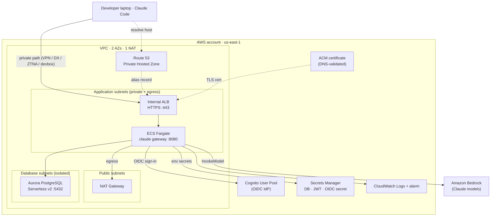

# Architecture

Resources deployed by the `ClaudeAppsGatewayStack` and how a `/login` request flows
through them. Placeholders (`corp.example.com`, `us-east-1`) match the README.

CloudFront and public DNS are intentionally **not** on the login path: the Claude
Code client checks that the gateway host resolves only to private addresses before
starting the gateway login flow.

## Request path

1. A developer on the private network runs `/login` in Claude Code. The hostname
   resolves through the **Route 53 Private Hosted Zone** to the internal ALB's
   private IPs.
2. The **internal ALB** terminates TLS on port 443 (ACM certificate, `RECOMMENDED_TLS`
   policy) and forwards to the gateway tasks on port 8080. The ALB security group
   only allows 443 from `allowedClientCidrs`.
3. The **ECS Fargate** gateway container runs the `claude gateway` server. The target
   group health check hits `/readyz`; the container health check hits `/healthz`.
4. Sign-in runs the **OIDC** authorization-code flow against the **Cognito User Pool**
   (hosted domain + confidential client). Only email domains in `allowedEmailDomains`
   are accepted.
5. Auth state, sessions, and rate-limit counters are stored in **Aurora PostgreSQL
   Serverless v2** (isolated subnets, reachable only from the gateway tasks).
6. Inference requests are translated and forwarded to **Amazon Bedrock** using the
   ECS task role (no static keys).

## Network isolation

Each tier has a dedicated security group so traffic only flows one direction at each
hop:

| Tier | Subnet type | Holds | Ingress allowed from |
|---|---|---|---|
| Public | `PUBLIC` | NAT Gateway | — |
| Application | `PRIVATE_WITH_EGRESS` | Internal ALB, Fargate tasks | ALB: 443 from `allowedClientCidrs`; Tasks: 8080 from ALB SG only |
| Database | `PRIVATE_ISOLATED` | Aurora PostgreSQL Serverless v2 | 5432 from task SG only |

## Key resources

- **VPC** — `maxAzs: 2`, `natGateways: 1` (egress for pulling the image, OIDC
  discovery, and Bedrock calls).
- **Aurora PostgreSQL Serverless v2 (16.13)** — single writer scaling 0.5–2 ACU,
  storage-encrypted, 7-day backups, deleted with the stack (`RemovalPolicy.DESTROY`).
- **Cognito User Pool** — self sign-up disabled, email sign-in, deleted with the
  stack; confidential app client with the authorization-code grant and
  `https://<host>/oauth/callback` callback.
- **ACM certificate** — issued for `gatewayHost` and validated via DNS in the public
  hosted zone named `hostedZoneName`; the ALB uses it for TLS.
- **Secrets Manager** — DB credentials, a generated 48-char JWT secret, and the
  Cognito client secret; injected into the task as environment secrets.
- **ECS Fargate** — cluster with Container Insights v2; task 512 CPU / 1024 MiB on
  ARM64; task role scoped to `bedrock:InvokeModel` and
  `bedrock:InvokeModelWithResponseStream` on `anthropic.*` inference-profile /
  application-inference-profile / provisioned-model / foundation-model ARNs.
- **Observability** — CloudWatch log group (one-month retention) and an alarm on
  unhealthy target hosts.
